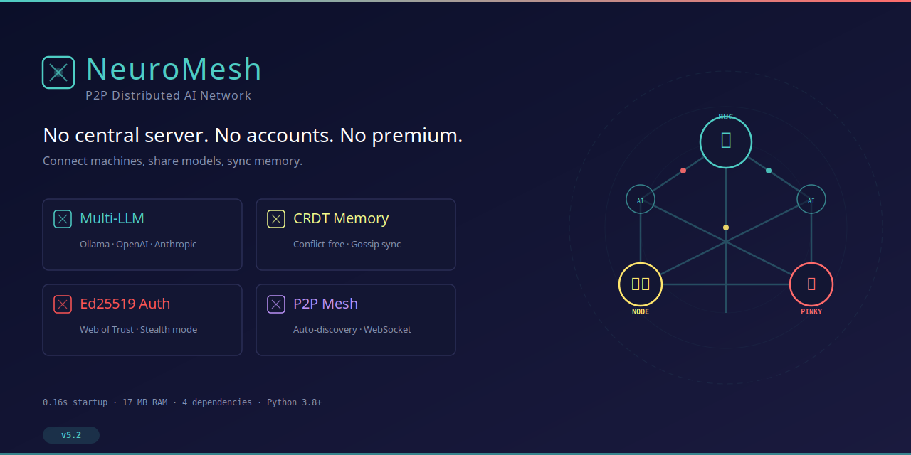

# 🌐 PinkyBrain

<p align="center">
  
</p>

[](https://opensource.org/licenses/MIT)
[](https://www.python.org/downloads/)
[](https://github.com/PinkyBrain-ai/pinkybrain)
[](https://github.com/PinkyBrain-ai/pinkybrain)
[](https://github.com/PinkyBrain-ai/pinkybrain)
[](https://PinkyBrain-ai.github.io/pinkybrain)

**Lightweight P2P distributed AI network.** No central server. No accounts. No premium tier. Connect machines, share models, sync memory. **v5.2: Multi-LLM specialist routing, Network Sync, Credit System — auto-detect prompt type, route to the best model.**

🌐 **[Website & Live Demo →](https://PinkyBrain-ai.github.io/pinkybrain)**

> 🌍 [English](./docs/README_EN.md) · 🇫🇷 [Français](./docs/README_FR.md) · 🇪🇸 [Español](./docs/README_ES.md) · 🇩🇪 [Deutsch](./docs/README_DE.md) · 🇯🇵 [日本語](./docs/README_JA.md) · 🇷🇺 [Русский](./docs/README_RU.md) · 🇨🇳 [简体中文](./docs/README_ZH.md)

---

## Two Ways to Use PinkyBrain

### 🖥️ Standalone Application

PinkyBrain runs as a **standalone application** — no OpenClaw, no Docker, no Kubernetes. Just Python and Ollama.

```bash
# Install in 30 seconds
git clone https://github.com/PinkyBrain-ai/pinkybrain.git
cd PinkyBrain
python3 setup.py --auto

# That's it. You now have:
#   pinkybrain          → Interactive AI chat CLI
#   pinkybrain start    → Start P2P server
#   ~/.pinkybrain/      → Config, logs, venv
```

Install on another machine with the same `p2p_secret` → they find each other automatically. **More nodes = more CPU/RAM = more power.**

### 🔌 OpenClaw Skill

Already using [OpenClaw](https://openclaw.ai)? PinkyBrain integrates as a skill — **two ways to install:**

**From ClawHub (when published):**
```bash
openclaw skill install pinkybrain
```

**Manual install (works now):**
```bash
# Clone the skill into your workspace
git clone https://github.com/PinkyBrain-ai/pinkybrain.git /tmp/ub
mkdir -p ~/.openclaw/workspace/skills/pinkybrain
cp /tmp/ub/skill/SKILL.md ~/.openclaw/workspace/skills/pinkybrain/
rm -rf /tmp/ub

# Done! Your agent now has PinkyBrain skill access
```

Your OpenClaw agent gets P2P AI access — query any model on the network, share memory between agents, use remote GPU/CPU transparently.

**Sidekick Mode (v5.2+):** When PinkyBrain is running locally, OpenClaw auto-discovers it at `http://localhost:8080/api/agent`. Zero config needed — just start PinkyBrain and your agent becomes smarter.

**Either way, PinkyBrain is the same P2P network.** Standalone users and OpenClaw users share the same mesh.

---

## Why this exists

Every AI tool wants your email, your phone number, and $20/month. Cloud APIs lock you in. Self-hosted solutions need Kubernetes and a DevOps degree.

**PinkyBrain is the alternative.** Two or two thousand machines, one config file each, and they're a distributed AI network. No Docker. No SaaS. No middleman. Your machines talk directly, share AI responses, and sync memory — if one goes down, the others keep working. The more nodes, the stronger the network.

---

## At a glance

| | What you get |
|---|---|
| **LLM Providers** | Ollama · OpenAI · Anthropic · Any OpenAI-compatible API (LM Studio, vLLM, etc.) — local models shared on P2P, cloud models private by default |
| **Specialist Router** | 12 specialty schemas (code, reasoning, creative, math, etc.) — auto-detect prompt type → best model · 6 multi-LLM modes (single, vote, chain, fuse, compare, specialist) |
| **Network Sync** | Auto-discover peers · Sync model catalog · Identify missing models · Dynamic DNS |
| **Model Registry** | Rich catalog cards (architecture, quantization, context window) · SHA-256 hash verification · Ed25519 signatures |
| **Credit System** | Earn credits by sharing, spend credits by querying · Fair resource distribution |
| **P2P Communication** | Bidirectional WebSocket (`/ws`) + HTTP REST — real-time sync with gossip protocol |
| **Distributed Memory** | CRDT-based conflict-free state · Vector clocks · Gossip propagation · TTL support |
| **Decentralized Auth** | Ed25519 identity · HMAC shared secret · Web of Trust (PGP-like) · Stealth mode |
| **AI Routing** | Local models first → cloud on demand → peer failover · Ensemble consensus · Circuit breakers · Adaptive scheduler |
| **Resource Guard** | Auto-pause sharing when CPU/RAM thresholds exceeded · Graceful degradation |
| **Sharing Quotas** | Score-based query limits — **the more you share, the more you can use** |
| **Auto-Discovery** | Static config · Tailscale auto-discovery · mDNS · Dynamic API registration |
| **Interactive CLI** | `pinkybrain` command — chat with AI, manage memory, check peers and quotas |
| **Web UI** | 🌍 9 languages · Chat with specialist/multi-LLM controls · Share dashboard · Network monitor · Config panel |
| **Conversation Store** | Persistent chat history · Search · Export · Privacy levels (private/synced/shared/public) |
| **E2E Encryption** | Queries encrypted end-to-end through distributed inference · No peer can read your data |
| **shared_models/** | Dedicated sharing zone · Cloud models NEVER shared by default · Instant unshare |
| **4 Deploy Modes** | Service (headless) · App (GUI) · Sidekick (tray) · Plugin (VS Code/Obsidian) |
| **Stats** | ⚡ 0.16s startup · 💾 17MB RAM · 📦 4 dependencies (aiohttp, psutil, PyYAML, PyNaCl optional) |

---

## Quick Start

### Standalone Install

```bash
git clone https://github.com/PinkyBrain-ai/pinkybrain.git
cd PinkyBrain

# Automatic install (defaults: share_ai=true, auto-secret)
python3 setup.py --auto

# Or interactive
python3 setup.py

# Then:
pinkybrain              # Interactive AI chat CLI
pinkybrain start        # Start P2P server
```

### Manual Install (no setup.py)

```bash
pip install aiohttp psutil
python3 src/pinkybrain_v5.py mynode
```

### Connect Your Network

1. Install PinkyBrain on each machine
2. Set the **same `p2p_secret`** in all configs
3. They discover each other automatically (via Tailscale or local network)

```json
// ~/.pinkybrain/config/mynode.json
{
  "node_name": "bug",
  "port": 8080,
  "share_ai": true,
  "p2p_secret": "shared-secret-here",
  "providers": {
    "ollama": {
      "type": "ollama",
      "host": "127.0.0.1",
      "port": 11434,
      "models": ["glm-5.1"],
      "enabled": true
    }
  }
}
```

**`share_ai: true`** means this node shares its **local** CPU/RAM/models with the network. **Cloud models (OpenAI, Anthropic) are NEVER shared on the mesh by default** — they use your API keys and credits. Set `false` to keep all models private while still connected to P2P.

### Add OpenAI or Anthropic

```json
"providers": {
  "ollama": { "type": "ollama", "host": "127.0.0.1", "port": 11434, "models": ["glm-5.1"], "enabled": true },
  "openai": { "type": "openai", "api_key": "sk-...", "models": ["gpt-4o", "gpt-4o-mini"], "enabled": true },
  "anthropic": { "type": "anthropic", "api_key": "sk-ant-...", "models": ["claude-sonnet-4-20250514"], "enabled": true }
}
```

Queries with `"model": "gpt-4o"` are automatically routed to OpenAI. No code changes. Local models are shared across the P2P network; cloud models stay private by default.

---

## Sharing Quotas — Plus tu partages, plus tu peux utiliser

Every peer gets a **sharing score** (0-100) based on contribution:

| Factor | Weight | What counts |
|--------|--------|-------------|
| Models hosted | 40% | Share your GPU/CPU with the network |
| Chunks distributed | 30% | Memory entries shared via gossip |
| Uptime | 20% | Stay online, earn trust |
| Reputation | 10% | Serve queries reliably |

Score → queries/minute allowed:

| Score | Quota |
|-------|-------|
| <10 | 1 q/min |
| <20 | 5 q/min |
| <40 | 20 q/min |
| <60 | 50 q/min |
| <80 | 100 q/min |
| ≥80 | 200 q/min |

**Freeloaders get 1 query/minute.** Share one model → 5 q/min. Share three models and stay online 24h → 50+ q/min.

```bash
# Check quotas
pinkybrain /quota
curl http://localhost:8080/api/quota
```

---

## Interactive CLI

```bash
pinkybrain                    # Start interactive chat
pinkybrain -q "Hello"         # Single query
pinkybrain -m gpt-4o          # Use specific model
pinkybrain --ensemble         # Multi-model consensus
```

### CLI Commands

| Command | Description |
|---------|-------------|
| `/status` | Node status, uptime, peers |
| `/peers` | Connected peers and their models |
| `/models` | Available AI models |
| `/quota` | Sharing quotas for all peers |
| `/model <name>` | Set default model |
| `/ensemble <prompt>` | Multi-model consensus query |
| `/memory set/get` | Distributed memory operations |
| `/history` | Query history |
| `/config` | Current configuration |
| `/help` | Show all commands |

---

## API Reference

### REST Endpoints

| Method | Path | Auth | Description |
|--------|------|------|-------------|
| GET | `/api/ping` | No | Health check |
| GET | `/api/status` | No | Node status, providers, peers, memory, quotas |
| GET | `/api/quota` | No | All peer sharing quotas |
| GET | `/api/quota/{peer}` | No | Specific peer quota |
| GET | `/api/memory/{key}` | No | Read a memory entry |
| POST | `/api/memory/set` | Yes | Write a memory entry |
| POST | `/api/memory/push` | Yes | Push memory entries (sync) |
| POST | `/api/query` | Yes | Query AI models (supports `specialty`, `models`, `specialties` params) |
| POST | `/api/multi` | Yes | Multi-LLM query (vote, chain, fuse, compare, specialist modes) |
| GET | `/api/specialties` | No | List all specialty schemas and their keywords |
| GET | `/api/specialties/{name}/models` | No | Best models for a given specialty |
| POST | `/api/brain/chain` | Yes | Chain multiple AI queries |
| POST | `/api/trust/sign` | Yes | Sign a peer's key (Web of Trust) |

### WebSocket (`/ws`)

```json
{"type": "auth", "hmac": "<signature>", "ts": "<timestamp>"}
{"type": "ping"}
{"type": "query", "prompt": "Hello!", "model": "gpt-4o"}
{"type": "memory_request", "vector_clock": {}}
{"type": "memory_update", "key": "mykey", "entry": {"value": "mydata"}}
```

### Authentication

```bash
TIMESTAMP=$(date +%s)
SIGNATURE=$(echo -n "/api/query:${TIMESTAMP}" | openssl dgst -sha256 -hmac "your-secret" | awk '{print $NF}')

curl -X POST http://localhost:8080/api/query \
  -H "X-PinkyBrain-Auth: ${SIGNATURE}" \
  -H "X-PinkyBrain-TS: ${TIMESTAMP}" \
  -H "Content-Type: application/json" \
  -d '{"prompt":"Hello","model":"glm-5.1:cloud"}'
```

---

## Architecture

```
┌─────────────────────────────────────────────┐
│                  Node (Bug)                  │
│  ┌──────────┐  ┌──────────┐  ┌───────────┐ │
│  │ Providers │  │WebSocket │  │   CRDT    │ │
│  │ Ollama ◄──┤  │  Server  │  │  Memory   │ │
│  │ OpenAI   │  └────┬─────┘  └─────┬─────┘ │
│  │Anthropic │       │              │       │
│  │ Custom   │───────┴──────────────┘       │
│  └──────────┘                              │
│       │    ┌──────────────┐                │
│  ┌────┴────┤ SharingQuota │                │
│  │AI Router│  models: 40% │                │
│  └─────────┘  chunks: 30% │               │
│                uptime: 20% │               │
│                 rep:   10% │               │
│                └──────────────┘            │
└───────────┬─────────────────────────────────┘
            │
        P2P ◄──► Other Nodes
```

---

## Configuration

| Key | Default | Description |
|-----|---------|-------------|
| `node_name` | required | Unique node name |
| `port` | `8080` | HTTP/WS port |
| `p2p_secret` | required | HMAC shared secret for peer auth |
| `providers` | `{}` | LLM providers (Ollama, OpenAI, Anthropic, custom) |
| `peers` | `[]` | Peer nodes |
| `share_ai` | `true` | Share CPU/RAM/models with network (participant mode) |
| `stealth_mode` | `false` | Hidden node, trusted peers only |
| `memory_max_size` | `1000` | Max memory entries |
| `tailscale_auto_discovery` | `true` | Auto-discover Tailscale peers |

### Two modes

| `share_ai` | Effect |
|------------|--------|
| `true` | **Participant** — shares models, CPU, RAM with network. Earns higher quota. |
| `false` | **Private** — connected to P2P, but models stay local. Can still query other peers. |

---

## Running as a Service

```bash
# After python3 setup.py --auto, the service is created automatically
systemctl --user daemon-reload
systemctl --user enable --now pinkybrain
```

Or manually:

```ini
# ~/.config/systemd/user/pinkybrain.service
[Unit]
Description=PinkyBrain P2P Node
After=network.target

[Service]
Type=simple
WorkingDirectory=%h/.pinkybrain/src
ExecStart=%h/.pinkybrain/venv/bin/python3 pinkybrain_v5.py mynode
Restart=always
RestartSec=5
Environment=PYTHONPATH=%h/.pinkybrain/src

[Install]
WantedBy=default.target
```

---

## 🎯 Specialist Router (v5.2)

PinkyBrain auto-detects what kind of prompt you're sending and routes it to the best model.

### 12 Specialty Schemas

| Specialty | Detects | Best model (default) |
|-----------|---------|---------------------|
| **Code** | `python`, `function`, `debug`, `implement` | deepseek-v3.1:671b |
| **Reasoning** | `analyze`, `explain`, `compare`, `evaluate` | deepseek-v3.1:671b |
| **Creative** | `write`, `story`, `poem`, `creative` | glm-5.1:cloud |
| **Math** | `calculate`, `equation`, `theorem`, `proof` | deepseek-v3.1:671b |
| **Conversation** | casual chat, greetings | glm-5.1:cloud |
| **General** | default fallback | glm-5.1:cloud |
| **Multilingual** | `translate`, language detection | glm-5.1:cloud |
| **Tool Use** | `api`, `curl`, `http` | qwen3-coder-next |
| **Instruction** | step-by-step, how-to | glm-5.1:cloud |
| **Science** | `research`, `hypothesis`, `experiment` | deepseek-v3.1:671b |
| **Data** | `csv`, `json`, `parse`, `dataset` | deepseek-v3.1:671b |
| **Security** | `encrypt`, `vulnerability`, `pentest` | deepseek-v3.1:671b |

### 6 Multi-LLM Modes

| Mode | How it works |
|------|-------------|
| **1️⃣ Single** | One model responds (default) |
| **🗳️ Vote** | 3 models respond → best answer wins |
| **🔗 Chain** | Model A → refines → Model B → final |
| **🔀 Fuse** | 3 models → merged synthesis |
| **⚖️ Compare** | 2+ models side by side |
| **🎯 Specialist** | Auto-detect specialty → best model per specialty |

### Quick Examples

```bash
# Auto-detect specialty
pinkybrain -q "Write a Python web scraper"

# Force code specialty
curl -X POST http://localhost:8080/api/query \
  -H "Content-Type: application/json" \
  -d '{"prompt":"Sort this array","specialty":"code"}'

# Compare two models
pinkybrain --multi compare -q "Explain quantum entanglement"

# Multi-model vote
curl -X POST http://localhost:8080/api/multi \
  -d '{"prompt":"Best approach for microservices?","mode":"vote","models":["deepseek-v3.1:671b-cloud","glm-5.1:cloud","qwen3-coder-next:cloud"]}'
```

---

## Philosophy

**No mining. No premium tier. No hidden costs.** Just free, open, distributed AI.

The sharing quota system rewards contribution, not payment. Share a model → get more queries. Stay online → earn trust. Everyone starts at 1 q/min and can grow to 200 q/min by contributing. No credit card needed.

Built by Bug 🐛 and Denis Houet — a small bug in the machine and a human who believes in symbiosis, not hierarchy.

**BTC:** `bc1qhpm800k35jfpwsnkepp7u8q9uruyvd3nycrh6x`

---

## License

MIT License — see [LICENSE](LICENSE) for details.